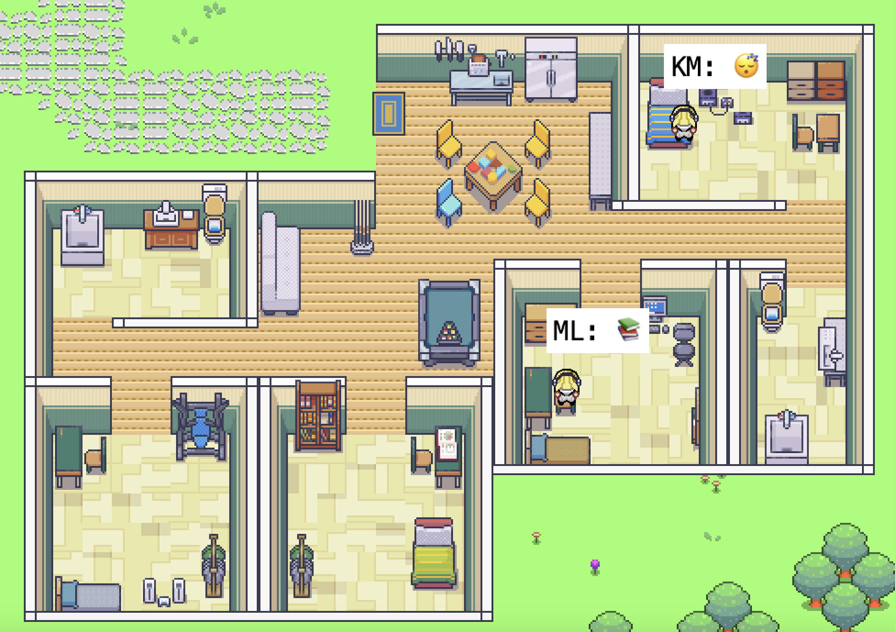

# Generative Agents Collaboratively Mission-Planning 

<p align="center" width="100%">

</p>

This repository explores emergent social behaviors in generative agents, building upon the paper "[Generative Agents: Interactive Simulacra of Human Behavior](https://arxiv.org/abs/2304.03442)." The project specifically focuses on simulating party environments to study complex social dynamics and emergent behaviors.

_______________________________________
## Index:
1. [Project Overview](#project-overview)
2. [Setup](#setting-up-the-environment)
3. [Execution](#running-a-simulation)
4. [Cost-Tracking](#cost-tracking)
5. [Customizing the Map](#customizing-the-map)
6. [Party Simulation](#party-simulation)
_______________________________________

## Project Overview

This project investigates how autonomous agents form social groups, share information, and adapt their plans within structured social environments. Key research areas include:

- Formation of social groups based on memory and perception
- Information diffusion in locally-constrained environments
- Impact of limited memory retrieval on decision-making
- Real-time plan adaptation
- Emergent patterns in dynamic schedule adjustment

### Simulation Types
- **Informal Get-together**: Casual social interactions
- **Formal Networking Event**: Professional networking dynamics

### Quantifiable Metrics
- Information Spread (with whisper function)
- Social Clustering
- Adaptation Rate
- Interaction Density
- Acceptance/Rejection Rate
- Agent Mobility
- Conversation Duration

### Visualizing Metrics
The project includes a comprehensive visualization system to analyze emergent behaviors in the simulation. To generate visualizations:

1. Install the required dependencies:
```bash
pip install matplotlib seaborn networkx pandas numpy
```

2. Run the visualization script:
```bash
python reverie/backend_server/persona/insight/visualize_metrics.py
```

This will generate several visualizations in the `visualizations` directory:

- **Interaction Network**: Shows the social network structure of agents with edge thickness representing interaction frequency
- **Interaction Heatmap**: Displays the frequency of interactions between all pairs of agents
- **Information Spread**: Visualizes how much information each agent has received
- **Acceptance/Rejection Rates**: Shows the ratio of successful vs failed interactions
- **Zone Movements**: Displays agent mobility patterns between different zones
- **Conversation Durations**: Shows the distribution of conversation lengths

These visualizations help analyze:
- Social network formation and dynamics
- Information propagation patterns
- Success rates of social interactions
- Spatial behavior and movement patterns
- Typical conversation characteristics

## Party Simulation

### Environment Structure
The party environment is modeled as a tree-structured space with distinct zones:
- Bar area
- Dance floor
- Lounge
- Entrance area

### Agent Roles
1. **Host** (1 agent)
   - Acts as a daemon influencing all agents
   - Rules and personality defined by the group

2. **Guests** (4 agents)
   - 3 agents modeled as digital twins of group members
   - 1 agent with randomized traits

### Agent Capabilities
- Local perception within their zone
- Memory stream storage (observations, reflections, plans)
- Dynamic plan modification
- Information sharing through whisper function
- Team formation and coordination

## Setting Up The Environment

### Step 1. Conda Env

Note: If you change the environment name from `simulacra`, you'll need to update the name in the upcoming bash scripts as well.
```bash
    conda create -n simulacra python=3.9.12 pip
    conda activate simulacra
    pip install -r requirements.txt
```


## Run Simulations

All of the following scripts accept two optional arguments to customize the conda setup:
- `--conda_path`: Path to your conda activate script (default: `/home/${USER}/anaconda3/bin/activate`)
- `--env_name`: Name of the conda environment to use (default: `simulacra`)

Example with custom conda setup:
```bash
./run_frontend.sh --conda_path /opt/anaconda3/bin/activate --env_name simulacra
```


Example:
```bash
    ./run_backend_automatic.sh --conda_path /opt/anaconda3/bin/activate --env_name simulacra -o base_party -t test_1 -s 400 --ui True
```


### Endpoint list
- [http://localhost:8000/](http://localhost:8000/) - check if the server is running
- [http://localhost:8000/simulator_home](http://localhost:8000/simulator_home) - watch the live simulation
- `http://localhost:8000/replay/<simulation-name>/<starting-time-step>` - replay a simulation

For a more detailed explanation see the [original readme](README_origin.md).

### Running a Demo

To create a polished demo with proper character sprites:

1. First, compress your simulation:
   - Open `reverie/compress_sim_storage.py`
   - Run the `compress()` function with your simulation name
   ```python
   compress("your_simulation_name")
   ```

2. View the demo in your browser:
   ```
   http://localhost:8000/demo/<simulation-name>/<starting-time-step>/<simulation-speed>
   ```
   
   Parameters:
   - `simulation-name`: Name of your simulation
   - `starting-time-step`: Where to begin the demo (e.g., 1)
   - `simulation-speed`: Speed from 1 (slowest) to 5 (fastest)

Example demo URL:
[http://localhost:8000/demo/test_1-s-0-0-186_good/1/3/](http://localhost:8000/demo/July1_the_ville_isabella_maria_klaus-step-3-20/1/3/)


## Authors
This project was developed as part of the Complex Systems course under the guidance of Professor Ali A. Minai.

### Team Members
- Adonai Vera
- Prateek Kharangate
- Haidar Bin Hamid